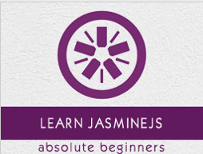

```
Roberto Nogueira  
BSd EE, MSd CE
Solution Integrator Experienced - Certified by Ericsson
```
# TutorialsPoint JasmineJS



**About**

`Jasmine` is one of the most popular tools for a JavaScript developer to deal with hectic testing process. It is an open source technology. It is a simple API to test different components of JavaScript. This tutorial discusses the basic functionalities of `Jasmine.js` along with relevant examples for easy understanding.

[Homepage](https://www.tutorialspoint.com//jasminejs/index.htm)

## Topics
```
JasmineJS Tutorial
[ ] Home
[ ] Overview
[ ] Environment Setup
[ ] Writing Text & Execution
[ ] BDD Architecture
[ ] Building Blocks of Test
[ ] Matchers
[ ] Skip Block
[ ] Equality Check
[ ] Boolean Check
[ ] Sequential Check
[ ] Null Check
[ ] Inequality Check
[ ] Not a Number Check
[ ] Exception Check
[ ] BeforeEach()
[ ] AfterEach()
[ ] Spies
JasmineJS Useful Resources
[ ] Quick Guide
[ ] Useful Resources
[ ] Discussion
Selected Reading
[ ] Developer's Best Practices
[ ] Questions and Answers
[ ] Effective Resume Writing
[ ] HR Interview Questions
[ ] Computer Glossary
[ ] Who is Who
```
